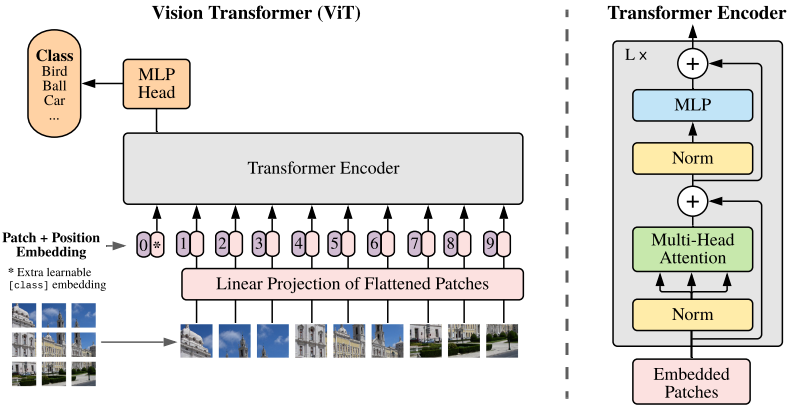
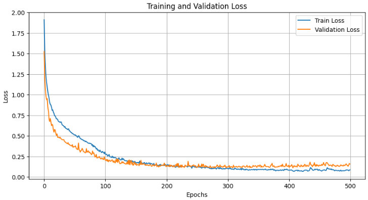
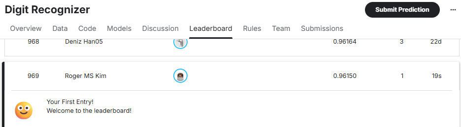

# Kaggle Digit Recognizer

This repository contains a solution for the Kaggle "Digit Recognizer" competition (getting started), utilizing a Vision Transformer (ViT) model implemented in PyTorch.

## Vision Transformer (ViT)



The core of this project is the Vision Transformer, a model that applies the transformer architecture, originally designed for natural language processing, to computer vision tasks.

### Key Concepts:

- **Patch Embedding:** The ViT model divides an image into fixed-size patches, flattens them, and then linearly embeds them. This sequence of embedded patches is then fed into a standard Transformer encoder.
- **Positional Embeddings:** To retain positional information, positional embeddings are added to the patch embeddings.
- **Transformer Encoder:** The Transformer encoder, composed of multi-head self-attention and feed-forward layers, processes the sequence of patches.
- **Classification Head:** A classification head is attached to the output of the Transformer encoder to predict the digit.

## Requirements

This project uses [Poetry](https://python-poetry.org/) for dependency management. The main dependencies are:

- `torch>=2.7.1`
- `pandas>=2.3.1`
- `tqdm>=4.67.1`
- `matplotlib>=3.10.5`

## Usage

1.  **Clone the repository:**
    ```bash
    git clone https://github.com/your-username/digit-recognizer.git
    cd digit-recognizer
    ```
2.  **Install dependencies:**
    ```bash
    poetry install
    ```
3.  **Run the Jupyter notebook**

## Hyperparameters

The following hyperparameters were used for training the Vision Transformer model:

| Hyperparameter    | Value   | Description                               |
| ----------------- | ------- | ----------------------------------------- |
| `BATCH_SIZE`      | 512     | Number of samples per batch               |
| `PATCH_SIZE`      | 4       | Size of the patches the image is split into |
| `EMB_DIM`         | 192     | Embedding dimension                       |
| `IMG_SIZE`        | 28      | Size of the input image (28x28)           |
| `IMG_DEPTH`       | 1       | Number of channels in the input image     |
| `NUM_CLASSES`     | 10      | Number of classes for classification      |
| `NUM_HEADS`       | 4       | Number of heads in the multi-head attention |
| `HIDDEN_DIM`      | 768     | Dimension of the feed-forward layer       |
| `DROP_OUT_RATE`   | 0.1     | Dropout rate                              |
| `WD`              | 0       | Weight decay                              |
| `LR`              | 4e-4    | Learning rate                             |
| `EPOCHS`          | 500     | Number of training epochs                 |

## Result

### Training

The training process is documented in the `vit.ipynb` notebook. It includes:

-   Loading the training data from `data/train.csv`.
-   Splitting the data into training and validation sets.
-   Training the ViT model.
-   Plotting the training and validation loss curves.
-   Saving the best model based on validation loss.

Here is a plot of the training and validation loss:



### Public Score & Leaderboard

#### Public Score: 0.96150
#### Leaderboard (Aug 2025): 969

